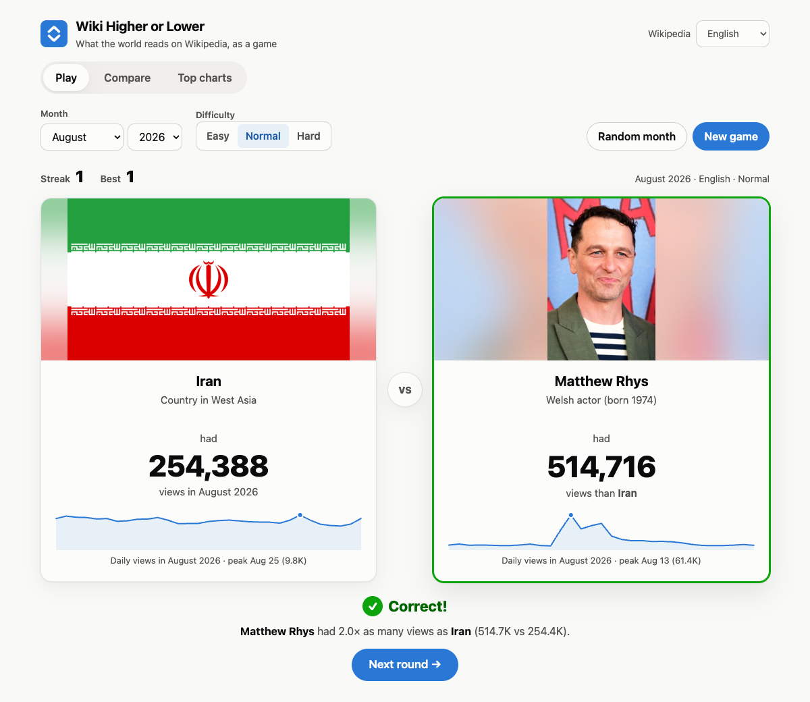
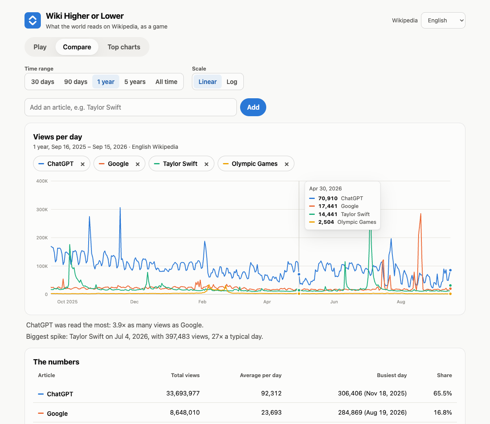
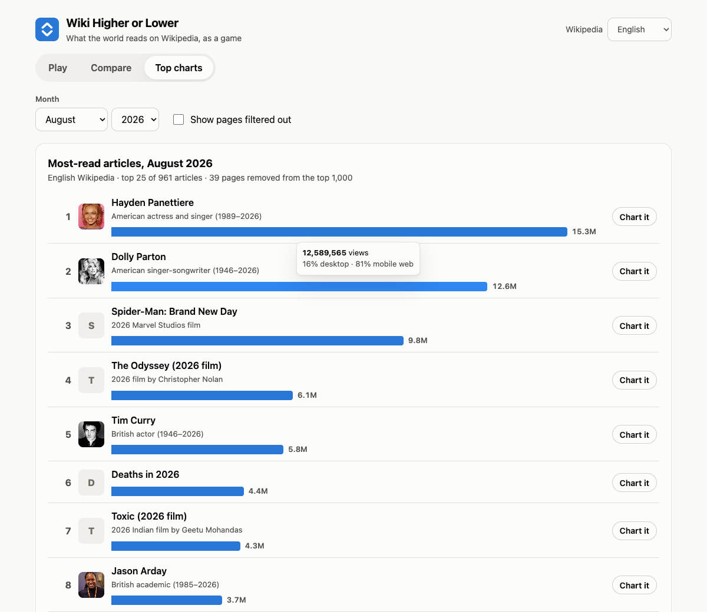

# Wiki Higher or Lower

**Which Wikipedia article got more views last month: Dolly Parton or ChatGPT?**
A browser game and data explorer built on live data from the Wikimedia Pageviews API.

**Play it:** https://rkottomt.github.io/wiki-higher-lower/



## What it does

The site has three tabs:

- **Play:** You see an article and how many times it was read in a given month. Guess whether the next article got more or fewer views, and keep your streak going. You can pick any month back to July 2015, one of seven Wikipedia languages, and a difficulty (Hard pairs articles within 30% of each other). After each guess, both cards show a sparkline of that month's daily views with the peak day marked. At game over you get a recap of every round and your best streak for that difficulty.
- **Compare:** Search for up to four articles (with autocomplete) and chart their daily or monthly views over 30 days to all time, on a linear or log scale. Hover or use the arrow keys to read exact values. A table lists totals, averages, busiest day, and share, and two auto-generated sentences point out the leader and the biggest spike. The URL updates as you go, so any chart can be shared as a link.
- **Top charts:** The month's most-read articles as a bar chart, plus an optional table of pages that were filtered out and why.

| Compare | Top charts |
| --- | --- |
|  |  |

## How the API is called

The app calls the [Wikimedia Pageviews REST API](https://doc.wikimedia.org/generated-data-platform/aqs/analytics-api/reference/page-views.html) directly from the browser with JavaScript's built-in `fetch()`, with no libraries and no API key. Every parameter goes in the URL path: the wiki (`en.wikipedia`), device type (`all-access`, `desktop`, or `mobile-web`), agent (`user`, which leaves out known bots), the article title, the granularity (`daily` or `monthly`), and start and end dates as `YYYYMMDD`, for example `/metrics/pageviews/per-article/en.wikipedia/all-access/user/Black_hole/daily/20260801/20260831`. The response is JSON: an `items` array of objects with a `timestamp` string such as `"2026080100"` and an integer `views`, or, for the monthly top list (`/metrics/pageviews/top/en.wikipedia/all-access/2026/08/all-days`), an `articles` array of `{article, views, rank}` objects. The app also uses the [MediaWiki Action API](https://www.mediawiki.org/wiki/API:Main_page) (`/w/api.php?action=query&origin=*`) to fix capitalization and follow redirects, look up thumbnails and short descriptions, and suggest spellings, plus the MediaWiki REST endpoint `/w/rest.php/v1/search/title` for autocomplete. All of these requests live in [`js/api.js`](js/api.js), which adds a 12-second timeout, caches repeated requests, and turns network failures and HTTP errors (404, 429, 5xx) into messages a player can act on.

**API key:** none. All three APIs are free and public, so the key rules for this assignment don't apply, and the site can run live on GitHub Pages.

Sample requests and raw responses, plus the surprises they revealed, are in [`docs/api-notes.md`](docs/api-notes.md).

## Running it locally

Nothing needs to be installed except Python 3, which is only used as a simple web server. (Browsers won't load JavaScript modules from a `file://` page, so double-clicking `index.html` won't work.)

```bash
git clone https://github.com/rkottomt/wiki-higher-lower.git
cd wiki-higher-lower
python3 -m http.server 8000
```

Then open http://localhost:8000.

### Tests

The data logic (article filtering, pair picking, date handling, and API error handling with a fake `fetch`) has unit tests. They need Node.js 18 or newer and no packages:

```bash
npm test
```

## Things I had to handle

The raw data turned out to be messier than expected. Here is what the app does about each problem:

| Problem found in the raw data | What the app does |
| --- | --- |
| The top-1000 list includes `Main_Page`, `Special:Search`, `File:…` pages, and translated versions like `Spezial:Suche` | Asks each wiki for its own namespace names and filters those pages out |
| Bot traffic the API missed (`.xyz`, `JSON-LD`, and `Neatsville, Kentucky` got 96–100% of views from one device type) | Compares the desktop and mobile top lists. More than 90% desktop or 95% mobile web counts as a likely bot, and every removed page is listed with its reason on the Top charts tab |
| Redirects are counted separately (`Obama` gets 3,598 views; `Barack Obama` gets the real number) | Resolves redirects before asking for views, and tells the user when it did |
| A misspelled title returns the same 404 as "no data" | Checks titles with the MediaWiki API first and offers a "Did you mean…?" suggestion |
| Days with zero views are left out of responses | Fills the gaps with zeros so charts don't skip days |
| Last month's rankings may not be published yet | Tries last month, then the month before |
| Old `wiki.phtml` URLs show up as "articles" on some wikis | Filtered out |

**Trying to break it.** These were checked with scripted runs in a headless Chromium browser:

- **Empty input:** asks you to type a title.
- **Misspelled title (`Blakc hole`):** "There's no English Wikipedia article called 'Blakc hole'. Did you mean 'Black hole'?"
- **A redirect (`obama`):** charts Barack Obama and explains why.
- **A fifth article:** explains the four-article limit.
- **Wi-Fi off:** a banner says you're offline, and requests show "You're offline" with a **Try again** button that works after you reconnect.

Rate limiting (HTTP 429), server errors, and 404 "no data" responses are covered by unit tests with a fake `fetch`, and each shows its own message instead of crashing.

## Project structure

```
index.html          page layout for the three tabs
css/style.css       styles, including light and dark mode
js/api.js           every network request, with error handling and caching
js/pool.js          filters the top list and picks fair article pairs (pure logic)
js/format.js        number/date helpers, time ranges, gap filling (pure logic)
js/chart.js         hand-written SVG line chart and sparklines with hover tooltips
js/game.js          Play tab
js/compare.js       Compare tab
js/top.js           Top charts tab
js/ui.js            DOM helpers, error and loading states, month picker
js/app.js           tab routing, language picker, offline banner
tests/              node:test unit tests
docs/api-notes.md   API exploration: sample requests, raw responses, edge cases
prompt_log.md       AI tools and key prompts used
```

## Notes on the data

- A "view" is a page load, not a unique person, and it's counted in UTC days.
- The game only uses articles from that month's top 1,000, so every article in it was very popular that month.
- The bot filter is a heuristic. It can occasionally remove a real article that was mostly read on one kind of device.
- Article text and images come from Wikipedia and Wikimedia Commons under their respective licenses. Pageview data is released under CC0.

## AI usage

Built with Claude Code. See [`prompt_log.md`](prompt_log.md) for the model, the prompts that shaped the project, and how the output was checked.
